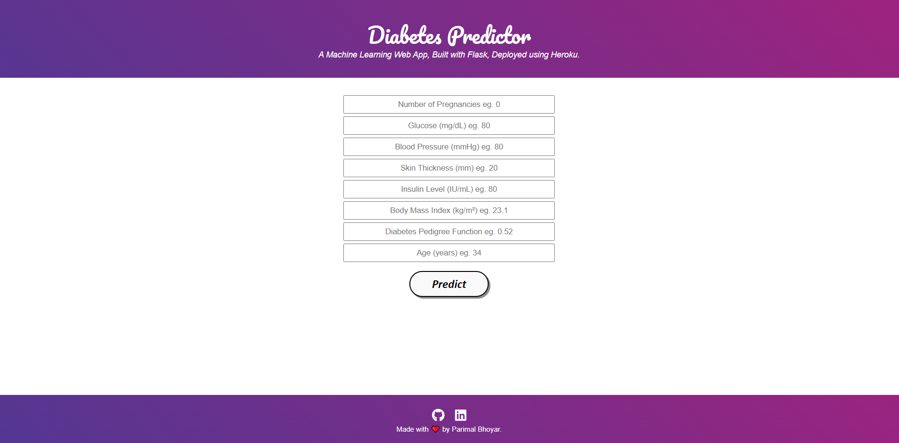
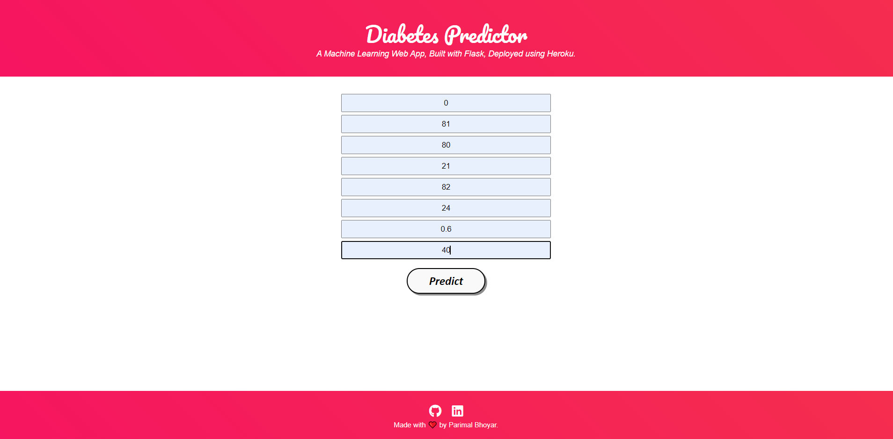
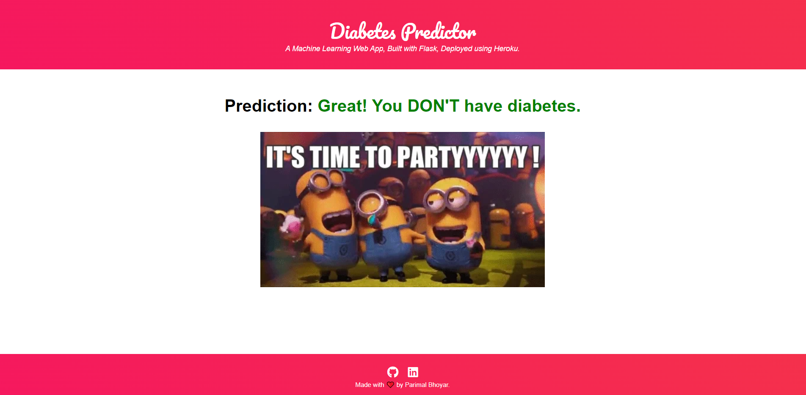

# Diabetes Prediction - Deployment
  

• This repository consists of files required to deploy a ___Machine Learning Web App___ created with ___Flask___ on ___Heroku___ platform.

• If you want to view the deployed model, click on the following link: 
Deployed at: https://diabetes-prediction-demo1.herokuapp.com/

• Please do ⭐ the repository, if it helped you in anyway.

• A glimpse of the web app:

_**----- Important Note -----**_ 
• If you encounter this webapp as shown in the picture given below, it is occuring just because **free dynos for this particular month provided by Heroku have been completely used.** _You can access the webpage on 1st of the next month._ 
• Sorry for the inconvenience.

